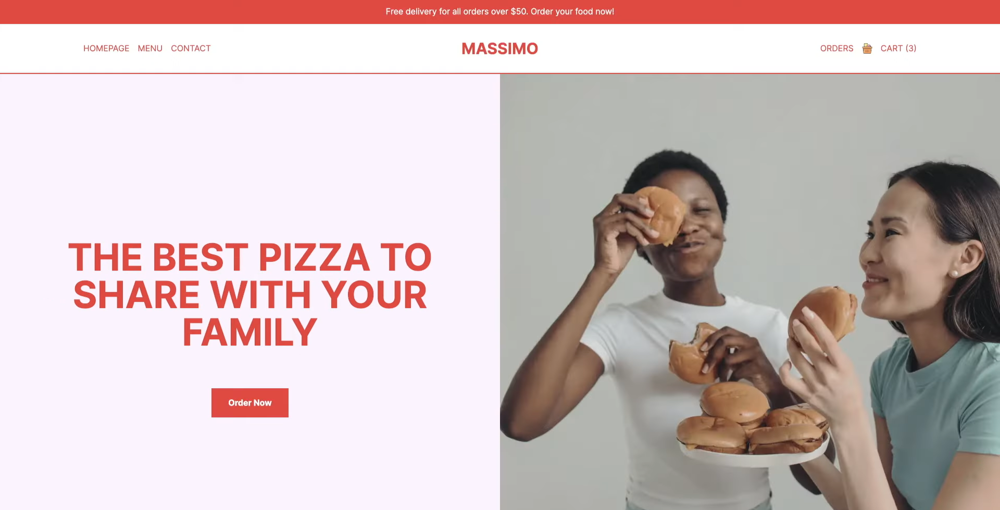
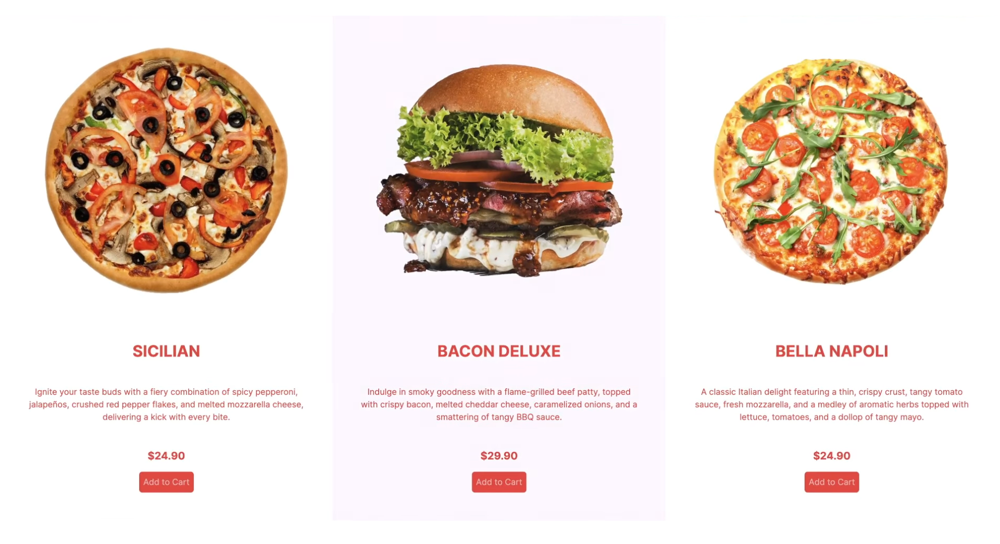
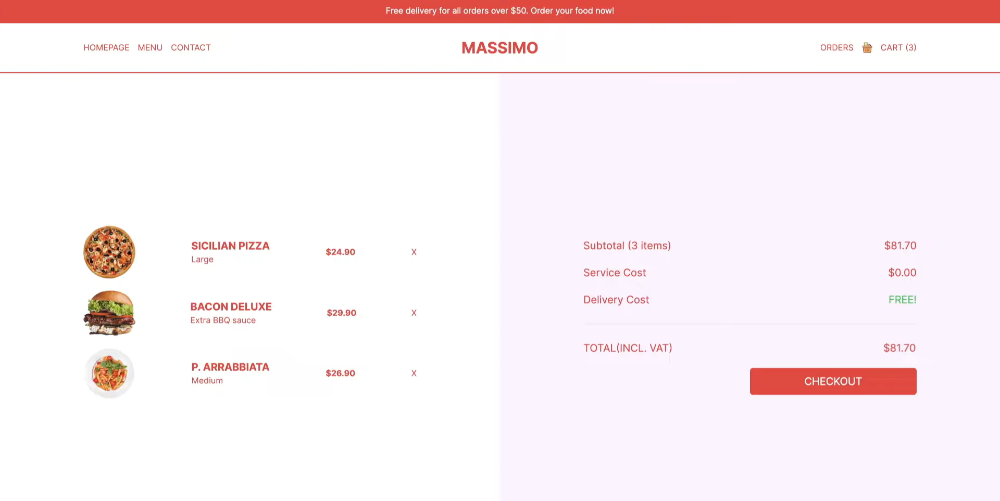

# Restaurant Website

A Restaurant Website UI built with React, Next.js, and Tailwind CSS. The project focuses on creating a modern, visually appealing restaurant website interface with navigation, sliders, featured products, category and product pages, footer, and user authentication pages.

---

## Project Images

<div align="center">
  <h3>Home Page</h3>
  
</div>

<br>

<div align="center">
  <h3>Menu Page</h3>
  
</div>

<br>

<div align="center">
  <h3>Checkout Page</h3>
  
</div>

---

## Technologies

```React.js``` ```Next.js``` ```Tailwind CSS``` 

---

## Features

- Responsive navbar adapting to desktop and mobile screens  
- Homepage with dynamic image sliders 
- Featured products and offers sections with hover effects  
- Category and product pages with filtering and responsive grid layouts  
- Single product pages with details, options, quantity selectors, and price calculation  
- Interactive cart and orders pages  
- Responsive footer with links and social icons  
- State management with React hooks for sliders, cart, and product options  

---

## Running the Project

1. Clone the repository:
   ```bash
   git clone https://github.com/ssharpalla2002/Restaurant_Website.git
   ```

2. Install dependencies:
   ```bash
   npm install
   ```

3. Start the development server:
   ```bash
   npm run dev
   ```

4. Open the application in your browser:
   ```
   http://localhost:3000
   ```

